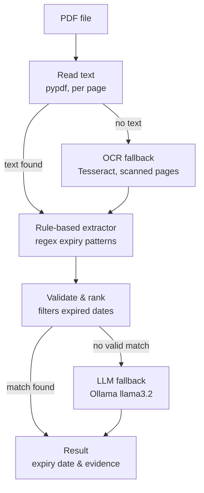

# PDF-Agent

An agent that reads a PDF and extracts its expiry date (license expiry, certificate validity, warranty end date, etc.), returning the date along with the evidence for why it was picked.

The codebase follows a hexagonal (ports & adapters) architecture: pipeline policy lives in `application/`, decoupled from the concrete PDF/OCR/LLM libraries in `infrastructure/`.

## How it works



1. **Read text** — [`PdfTextReader`](pdf_agent/infrastructure/pdf_reader.py) pulls text per page via `pypdf`.
2. **OCR fallback** — if no page has extractable text (a scanned/image PDF), [`TesseractOCR`](pdf_agent/infrastructure/ocr.py) rasterizes pages and OCRs them instead. If that still yields nothing, the agent raises `UnreadableDocumentError`.
3. **Rule-based extractor** — [`DateCandidateExtractor`](pdf_agent/application/date_candidate_extractor.py) runs regex patterns (`expiry date:`, `expires:`, `valid until:`, etc.) over every page. This is the fast, deterministic path — no LLM call needed when it works.
4. **Validate & rank** — [`ExpiryCandidateValidator`](pdf_agent/application/expiry_validator.py) drops candidates whose date is already in the past, then ranks what remains.
5. **LLM fallback** — only triggered when no valid rule-based candidate survives validation. [`OllamaLLM`](pdf_agent/infrastructure/llm.py) sends the document text to a local `llama3.2` model via [Ollama](https://ollama.com) with a strict JSON-only prompt.
6. **Result** — [`ExpiryAgent`](pdf_agent/application/agent.py) returns an `ExtractionResult` with the winning date, reasoning, and `Evidence` (page number, source text, which method found it) for auditability.

## Architecture

```
pdf_agent/
├── domain/            # Plain data models and exceptions — no dependencies
├── application/        # Orchestration and business rules
│   ├── ports/           # Abstract interfaces (PDFReader, OCR, LLM, CandidateExtractor)
│   ├── agent.py          # Orchestrates the pipeline above
│   ├── date_candidate_extractor.py   # Rule-based (regex) extractor
│   └── expiry_validator.py           # Filtering + ranking logic
├── infrastructure/     # Concrete adapters (pypdf, pytesseract, ollama)
├── config.py           # Env-driven settings
├── cli.py              # Composition root + command-line entry point
└── tests/
```

Swapping an adapter — a different OCR engine, a cloud LLM instead of Ollama — only touches `infrastructure/` and the `build_agent()` factory in `cli.py`; the pipeline policy in `agent.py` stays the same.

## Setup

Requires [Tesseract OCR](https://github.com/tesseract-ocr/tesseract) and [poppler](https://poppler.freedesktop.org/) installed locally (for the OCR fallback), and [Ollama](https://ollama.com) running locally with a model pulled (for the LLM fallback), e.g.:

```bash
ollama pull llama3.2
```

Then install the Python dependencies:

```bash
pip install -r requirements.txt
```

## Usage

```bash
python3 -m pdf_agent.cli path/to/document.pdf
```

Options:

| Flag | Description |
|---|---|
| `--model` | Ollama model for the LLM fallback (default: `$PDF_AGENT_OLLAMA_MODEL` or `llama3.2`) |
| `--poppler-path` | Path to poppler binaries, if not on `PATH` (default: `$PDF_AGENT_POPPLER_PATH`) |
| `-v`, `--verbose` | Log each pipeline stage to stderr |

## Testing

```bash
python3 -m pytest pdf_agent/tests/
```

Most tests run against fake ports and need no external tools. `test_agent_integration.py` also runs the real pipeline against every PDF in `pdf_agent/tests/fixtures/` — dropping a new PDF there gets it picked up automatically, no code changes needed. To assert an exact result, add a JSON file beside it with the same name, e.g. `my_doc.pdf` + `my_doc.json`:

```json
{
    "expiry_date": "2028-12-31",
    "extraction_method": "rule"
}
```

Use `"expiry_date": null` for a fixture that should yield no match. A fixture with no JSON file is still run as a smoke test (it must not raise), just without a specific assertion. Only text-extractable PDFs are supported here — this test wires in stub OCR/LLM ports that raise if a fixture actually needs them, so scanned PDFs requiring OCR or the LLM fallback need Tesseract/poppler/Ollama and are better covered by a manual `pdf_agent.cli -v` run.
